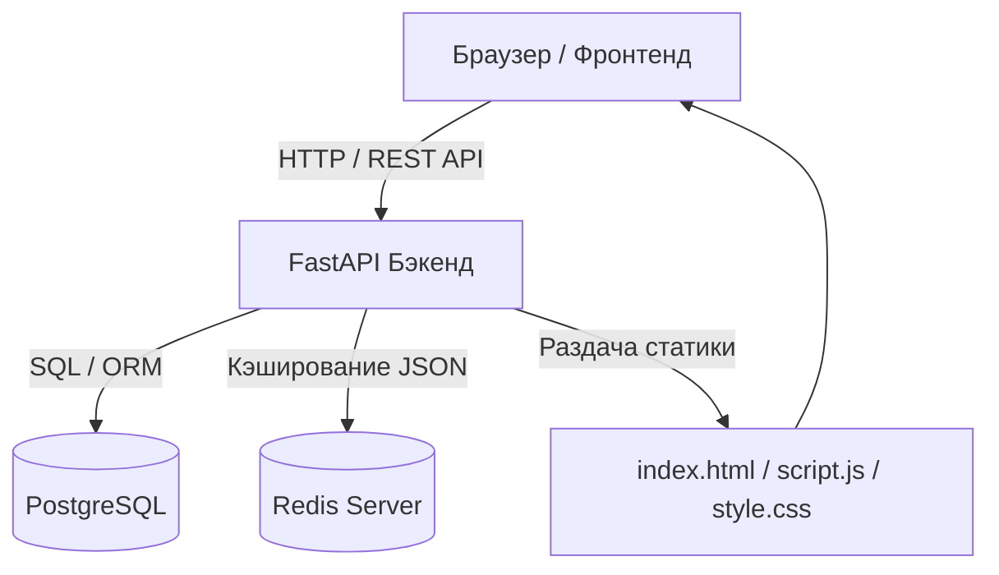

# Архитектура проекта Coffee & Bites

Этот документ содержит подробное описание архитектуры, структуры базы данных, механизмов аутентификации, кэширования и кода проекта кофейни.

---

## 1. Общий обзор архитектуры

Проект построен по клиент-серверной архитектуре и разделен на две основные части:
1. **Frontend (Клиент)**: Статический веб-сайт на базе HTML5, Vanilla CSS и чистого JavaScript (ES6). Общается с сервером через асинхронные HTTP-запросы (`fetch`).
2. **Backend (Сервер)**: Асинхронный веб-сервер на базе **FastAPI**, использующий **SQLAlchemy** (асинхронный драйвер `asyncpg`) для работы с СУБД **PostgreSQL** и асинхронный клиент `redis` для кэширования заказов.



---

## 2. База данных и ORM-модели

Все таблицы спроектированы в реляционном виде в PostgreSQL через декларативный стиль SQLAlchemy в файле [database.py](file:///c:/Users/ADMIN/PycharmProjects/FastApi2/client/back/database.py):

### Модели таблиц:
* **`User` (Таблица `users`)**:
  * `id` (`Integer`, Primary Key) — уникальный идентификатор пользователя.
  * `login` (`String`, Unique) — логин пользователя (телефон или почта).
  * `username` (`String`, Unique) — имя пользователя для отображения на выдаче.
  * `hashed_password` (`String`) — криптографический хэш пароля.
* **`Product` (Таблица `products`)**:
  * `id` (`Integer`, Primary Key) — идентификатор товара.
  * `name` (`String`) — название позиции (например, «Капучино»).
  * `description` (`Text`) — описание товара.
  * `price` (`Float`) — цена за единицу.
  * `image_url` (`String`) — путь к картинке на фронтенде.
  * `category` (`String`) — категория («Кофе» или «Сэндвичи»).
  * `is_available` (`Boolean`) — доступен ли товар для заказа.
* **`Order` (Таблица `orders`)**:
  * `id` (`Integer`, Primary Key) — идентификатор заказа.
  * `order_number` (`Integer`) — сгенерированный случайный номер заказа.
  * `user_id` (`Integer`, Foreign Key -> `users.id`) — связь с пользователем, совершившим заказ.
  * `status` (`String`, по умолчанию `'новый'`) — статус выполнения.
  * `created_at` (`DateTime`) — временная метка оформления заказа.
* **`OrderItemTable` (Таблица `order_items`)**:
  * `id` (`Integer`, Primary Key) — идентификатор позиции в заказе.
  * `order_id` (`Integer`, Foreign Key -> `orders.id` с каскадным удалением) — связь с родителем-заказом.
  * `product_id` (`Integer`, Nullable) — опциональная связь с товаром.
  * `name` (`String`) — копия названия товара на момент заказа.
  * `price` (`Float`) — копия цены на момент покупки.
  * `amount` (`Integer`) — купленное количество единиц.

---

## 3. Схема аутентификации (JWT)

Для защиты эндпоинтов и идентификации пользователей используется авторизация по стандарту **JWT (JSON Web Token)** с механизмом **Bearer Token**:

1. **Регистрация**: Клиент шлет логин, имя и пароль. Сервер хэширует пароль с помощью библиотеки **Argon2id** (избегая хранения в чистом виде) и записывает в PostgreSQL.
2. **Авторизация (Вход)**: Клиент отправляет учетные данные. Сервер проверяет соответствие хэша. В случае успеха генерирует JWT-токен, куда зашивает имя пользователя (`sub: username`) и срок действия (60 минут). Токен подписывается секретным ключом `SECRET_KEY` из файла `.env`.
3. **Хранение**: Фронтенд сохраняет полученный токен и имя в `localStorage` браузера.
4. **Валидация**: При каждом защищенном действии (оформление заказа, открытие ЛК) фронтенд прикрепляет заголовок `Authorization: Bearer <токен>`. Функция `get_current_user` в [auth.py](file:///c:/Users/ADMIN/PycharmProjects/FastApi2/client/back/auth.py) декодирует токен, проверяет подпись и загружает пользователя из PostgreSQL.
5. **Обработка сессии**: Если сервер возвращает `401 Unauthorized` (токен устарел или база сбросилась), фронтенд автоматически очищает `localStorage`, плавно уменьшает размер модального окна и перенаправляет пользователя на форму входа.

---

## 4. Кэширующий слой Redis

При создании нового заказа в [crud.py](file:///c:/Users/ADMIN/PycharmProjects/FastApi2/client/back/crud.py) данные отправляются не только в реляционную PostgreSQL, но и кэшируются в документо-ориентированный **Redis** в формате JSON-строки:

* **Ключ**: `order:<номер_заказа>` (например, `order:812`).
* **Структура значения**:
  ```json
  {
    "username": "Имя_пользователя",
    "order_number": 812,
    "items": [
      {
        "name": "Флэт Уайт",
        "price": 310.0,
        "amount": 1
      }
    ],
    "created_at": "2026-06-16T11:57:54.123456"
  }
  ```
Это разгружает основную PostgreSQL при чтении оперативных данных внешними системами (например, экраном выдачи заказов на кухне кофейни).

---

## 5. Структура файлов проекта и назначение кода

### Бэкенд (Папка `client/back/`)
* **[database.py](file:///c:/Users/ADMIN/PycharmProjects/FastApi2/client/back/database.py)**: Конфигурирует SQLAlchemy-движок и асинхронные сессии, объявляет ORM-модели таблиц БД и генератор сессий `get_db`.
* **[models.py](file:///c:/Users/ADMIN/PycharmProjects/FastApi2/client/back/models.py)**: Описывает Pydantic-схемы для валидации входящих JSON-запросов и форматирования исходящих ответов API (сериализация).
* **[auth.py](file:///c:/Users/ADMIN/PycharmProjects/FastApi2/client/back/auth.py)**: Реализует хэширование паролей, генерацию токенов и FastAPI-зависимость `get_current_user` для защиты эндпоинтов.
* **[crud.py](file:///c:/Users/ADMIN/PycharmProjects/FastApi2/client/back/crud.py)**: Содержит функции создания и чтения заказов из базы данных PostgreSQL и кэша Redis.
* **[redis_client.py](file:///c:/Users/ADMIN/PycharmProjects/FastApi2/client/back/redis_client.py)**: Создает асинхронный пул соединений с Redis.
* **[router.py](file:///c:/Users/ADMIN/PycharmProjects/FastApi2/client/back/router.py)**: Объявляет все REST API эндпоинты проекта (`/register`, `/login`, `/orders`, `/users/me`, `/orders/my`).

### Фронтенд (Папка `client/front/`)
* **[index.html](file:///c:/Users/ADMIN/PycharmProjects/FastApi2/client/front/index.html)**: Разметка интерфейса. Содержит структуру меню, корзины и двухвкладочного личного кабинета (настройки профиля и список заказов).
* **[style.css](file:///c:/Users/ADMIN/PycharmProjects/FastApi2/client/front/style.css)**: Премиальные стили интерфейса с переменными CSS. Описывает анимации открытия корзины/модалок, вкладки кабинета и класс `.cabinet-mode` для расширения окна до `650px`.
* **[script.js](file:///c:/Users/ADMIN/PycharmProjects/FastApi2/client/front/script.js)**: Логика страницы. Управляет корзиной, осуществляет асинхронные запросы к API бэкенда, отвечает за переключение вкладок личного кабинета и обрабатывает истечение сессии (код 401).

### Корневые файлы
* **[run_back.py](file:///c:/Users/ADMIN/PycharmProjects/FastApi2/run_back.py)**: Точка входа бэкенда. Инициализирует FastAPI-приложение, запускает создание таблиц в PostgreSQL при старте (Lifespan handler) и раздает статические файлы фронтенда.
* **[view_redis.py](file:///c:/Users/ADMIN/PycharmProjects/FastApi2/view_redis.py)**: Утилита для просмотра сохраненных заказов в Redis из терминала.
* **[.env](file:///c:/Users/ADMIN/PycharmProjects/FastApi2/.env)**: Конфигурационный файл с чувствительными данными (пароль к БД, SECRET_KEY, ссылка на Redis).
